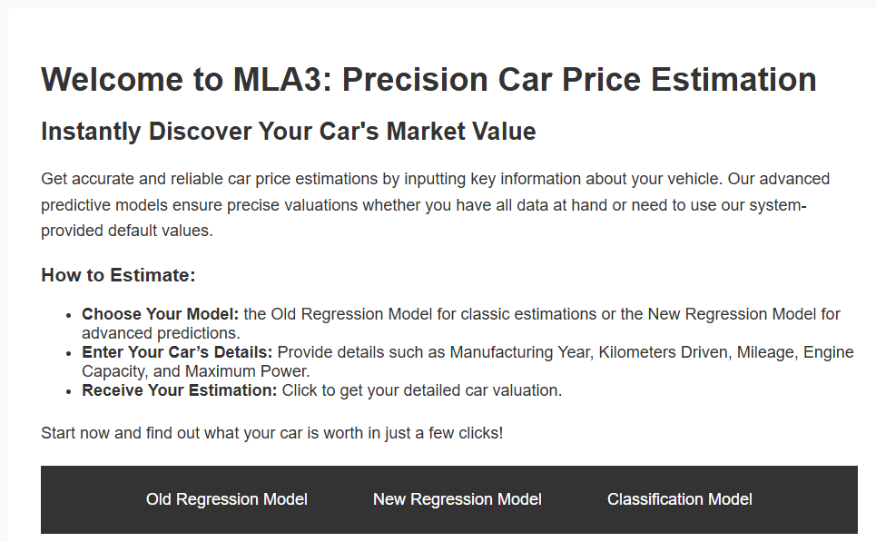
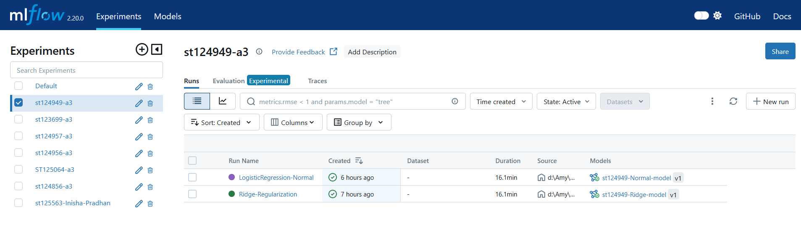
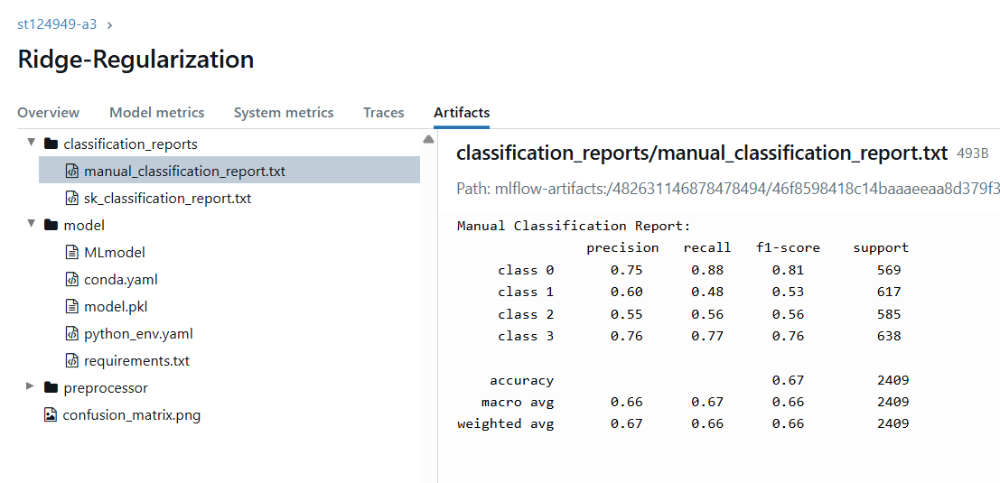
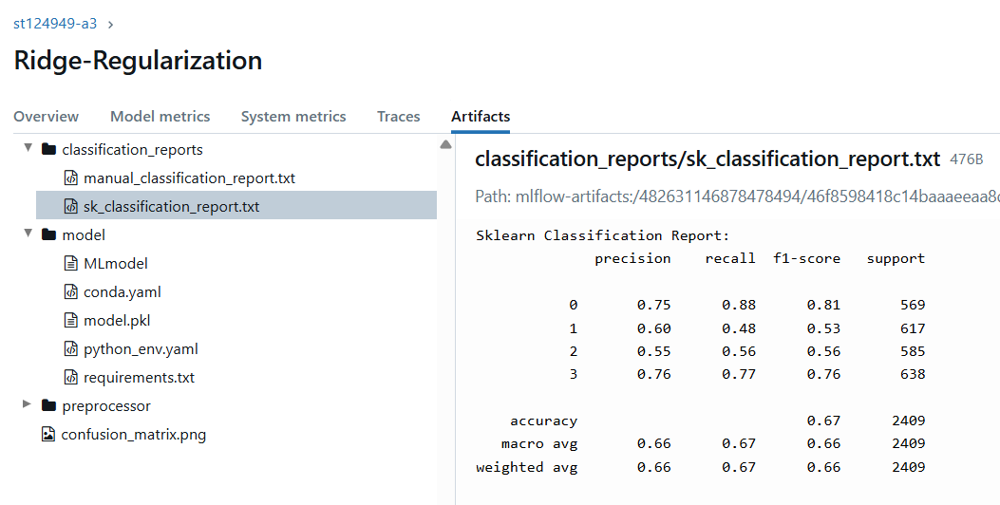

# Car Price Classification - Logistic Regression with Ridge Regularization

## Overview
This project classifies cars into price categories using Logistic Regression with Ridge regularization. It includes custom metric implementations, MLflow experiment tracking, and CI/CD automation.

**🔗 Live Demo:** [Car Price Classifier](https://st124949.ml.brain.cs.ait.ac.th/)

---

## Immediate Access

**Direct Model Access:**  
 [https://st124949.ml.brain.cs.ait.ac.th/](https://st124949.ml.brain.cs.ait.ac.th/) 👈

---

##  Features
- 4-class price categorization (0-3)
- Ridge/L2 regularization toggle
- Custom precision/recall/F1 implementations
- MLflow experiment tracking
- CI/CD with GitHub Actions

---

##  Implementation

### Task 3: Deployment
- **MLflow Tracking**: [https://mlflow.cs.ait.ac.th/](https://mlflow.ml.brain.cs.ait.ac.th/)
- **Model Registry**: Registered as `st124949-a3-model`
- **CI/CD Pipeline**:
  - Unit tests for input validation
  - Auto-deploy on successful tests
  - **CI/CD Status**: 

---

## Usage

1. **Access the Live Model**  
   [https://st124949.ml.brain.cs.ait.ac.th/](https://st124949.ml.brain.cs.ait.ac.th/)

2. **Input Car Details**  
     
   - Manufacturing Year
   - Kilometers Driven
   - Mileage
   - Engine Capacity
   - Max Power

3. **Toggle Ridge Regularization**

4. **Get Instant Prediction**  
     
   Displays price category and range

---

## MLflow Tracking
  
Track model runs and compare metrics on MLflow server.

---

## Model Validation
| Custom Implementation | sklearn Report |
|-----------------------|----------------|
|  |  |

---

## 🔍 CI/CD Results
  
Monitor automated testing and deployment status through our GitHub Actions pipeline.

---
